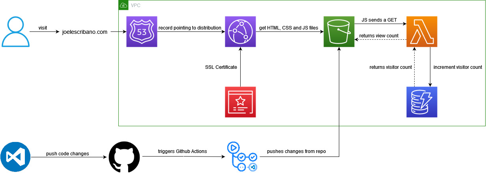

# Cloud Resume

Personal CV hosted in AWS S3 using CloudFront, Route53, Lambda and DynamoDB
--
Currículum en Markdown hosteado en AWS S3 que utiliza CloudFront, Route53, Lambda y DynamoDB
--

- I have designed my personal website to serve as my resume, utilizing various AWS services for optimal performance and functionality.
- The web content, including HTML, CSS, and JS files, is hosted in an Amazon S3 bucket.
- To enhance content delivery and reduce latency, I integrated it with Amazon CloudFront.
- For a professional and secure online presence, I registered my domain using Amazon Route 53 and obtained an SSL certificate via AWS Certificate Manager (ACM) to ensure data integrity and encryption.
- To track and display visitor statistics, I implemented a dynamic visitor counter. When someone accesses my CV, a JavaScript file triggers a request to a serverless AWS Lambda function. This Lambda function increments a view counter value stored in an Amazon DynamoDB table and retrieves the updated count, which is then presented to the person at the bottom of my CV."

# Diagram of the setup:

